# Agile development: build CI/CD Pipeline to Azure App Service

In this project, you will create a GitHub repository from scratch and set up scaffolding to enable **Continuous Integration (CI)** and  **Continuous Delivery (CD)** . Key tools used include:

* **GitHub Actions** for CI.
* **Azure Pipelines** for CD to Azure App Service.
* Supplementary files like `Makefile`, `requirements.txt`, and Python application code for testing, installation, and deployment.
* 

---

## **Project Plan**

* **Trello Board** : [Project Dashboard](https://trello.com/b/BBqfWn2b/dashboard-ml-product)
* **Spreadsheet Plan** : [Google Spreadsheet](https://docs.google.com/spreadsheets/d/e/2PACX-1vQlBP_CzxOHPZOf_BYZ1rj1u6cuJKdOc_D0Sr_6S8p3LbHKIo8UlGiQzyleR67kNa_dsIuxgTIsUZex/pubhtml)

---

## **Prerequisites**

1. [Azure Account](https://portal.azure.com/)
2. [GitHub Account](http://github.com/)
3. [CircleCI Account](https://circleci.com/)
4. [Azure DevOps Account](https://dev.azure.com/)

---

## **Part 1: CI Pipeline with GitHub Actions**

### **Architectural Diagram**

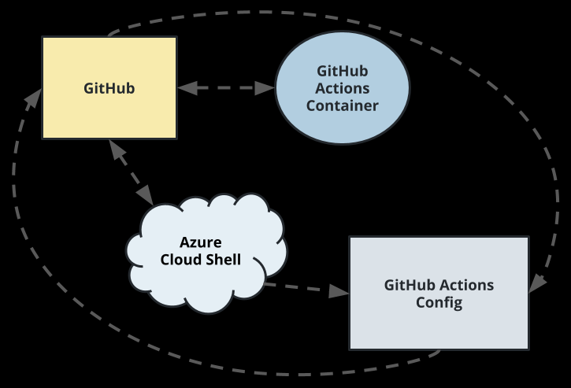

---

### **Instructions**

1. **Set up Azure Cloud Shell** :

* Access the [Azure Portal](https://portal.azure.com/) and open Azure Cloud Shell (select  **Bash** ).

2. **Generate SSH Keys** :

```
ssh-keygen -t rsa
cat ~/.ssh/id_rsa.pub
```

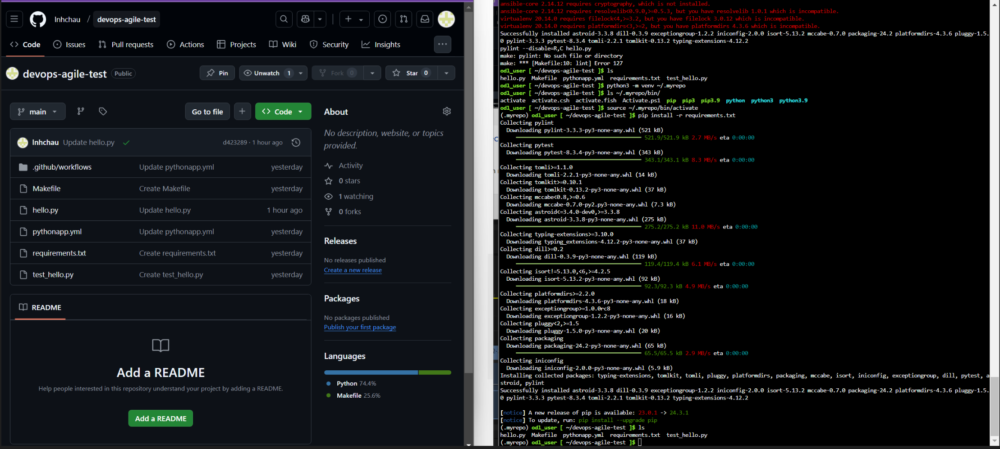

- Add the `id_rsa.pub` key to your GitHub repository’s SSH settings. Clone the repository using:
  ```
  git clone https://github.com/lnhchau/agile-sklearn.git
  ```

3. **Switch to the** hello-test-ci **branch** :

   ```
   git checkout hello-test-ci
   ```
4. **Scaffold the Project** :

   | File                 | Purpose                                    |
   | -------------------- | ------------------------------------------ |
   | `Makefile`         | Shortcuts to build, test, and deploy code. |
   | `requirements.txt` | Lists Python dependencies.                 |
   | `hello.py`         | Basic Python application.                  |
   | `test_hello.py`    | Unit tests for the application.            |
5. **Set up Virtual Environment** :

```
   python3 -m venv ~/.myrepo
   source ~/.myrepo/bin/activate
```

6. **Run CI Pipeline** :

* Execute:

  ```
  make all
  ```

- This will install dependencies, lint, and test the application.

  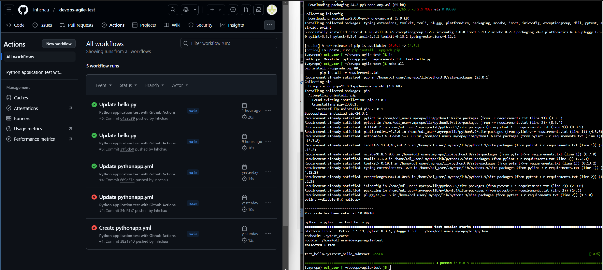

7. **Enable GitHub Actions** :

* Open `.github/workflows/pythonapp.yml` and make a minor edit to trigger GitHub Actions.

## **Part 2: CI/CD Pipeline with Azure DevOps**

### **Architectural Diagram**

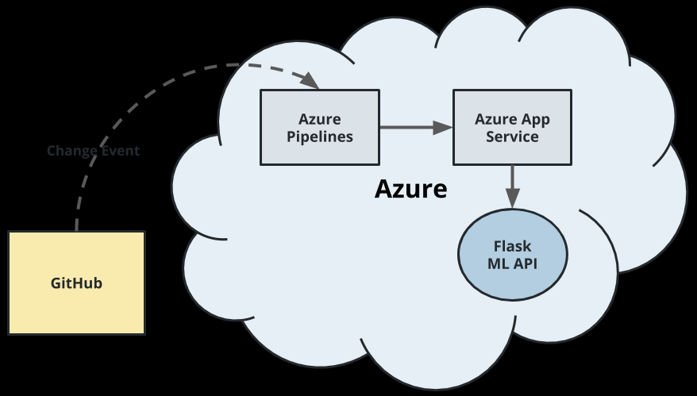

1. **Create Azure DevOps Project:**

* Log in to [Azure DevOps](https://dev.azure.com/) and create a new project.

2. **Set up Azure Service Connection:**

* Navigate to  **Project Settings > Service Connections** .
* Create a new **Azure Resource Manager** connection named `AZServiceConnection`.

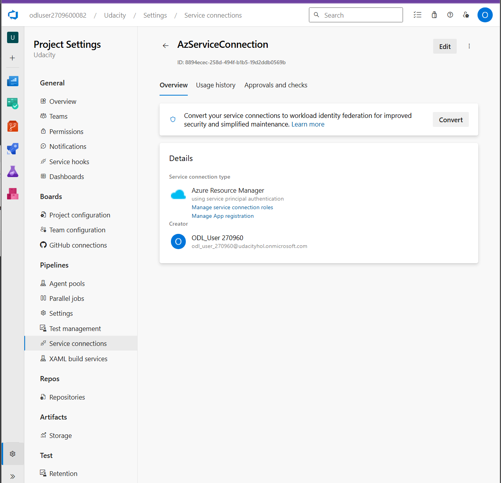

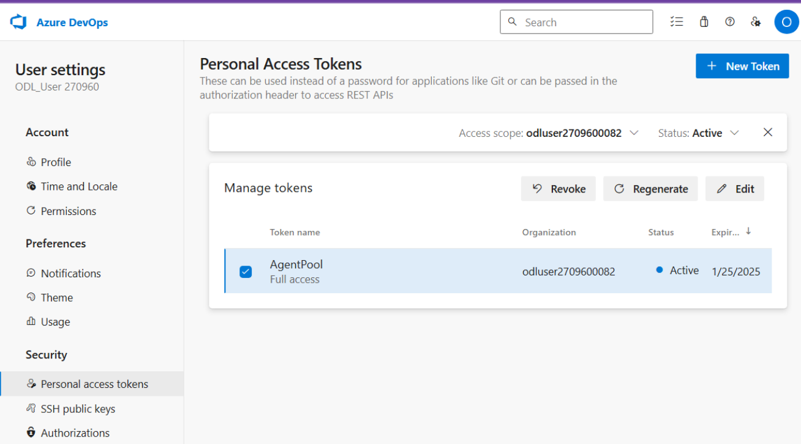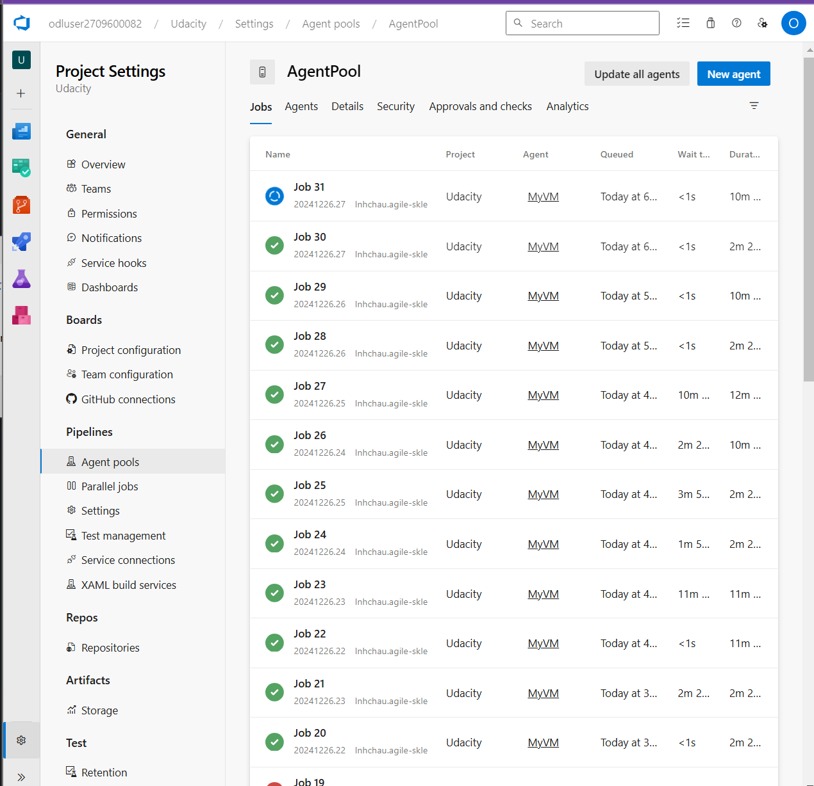

4. **Deploy Web App to Azure:**

   ```
   az webapp up -n <webapp-name> --location southcentralus --sku B1
   ```

   
5. **Configure Azure DevOps Pipeline** :

* Go to  **Pipelines > New Pipeline > GitHub > Select Your Repo** .
* Choose `main` branch and select the `azure-pipelines.yml` file.

---

## **Testing and Deployment**

1. **Verify the App** :

* Access the app at:

  ```
  https://<webapp-name>.azurewebsites.net/
  ```

2. **Trigger CI/CD Pipelines** :

* Make a minor change to `app.py`, for example:
  ```
  html = "<h2>Sklearn Prediction Home APP - RestAPI</h2>"
  ```

- Commit and push changes to trigger CI/CD.

  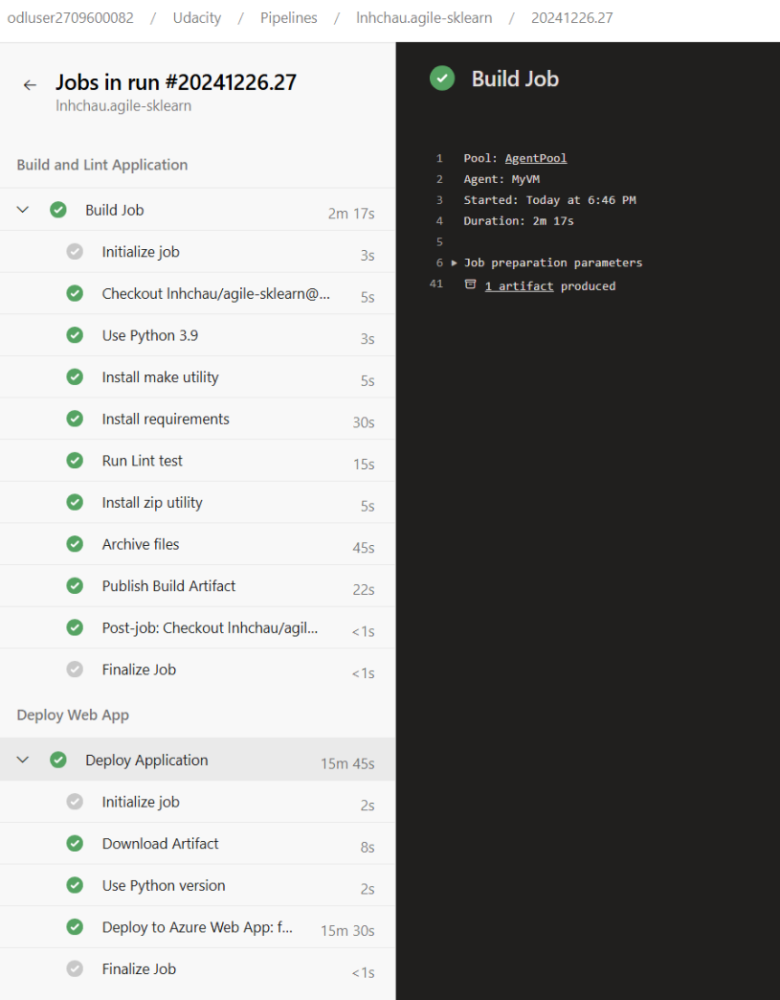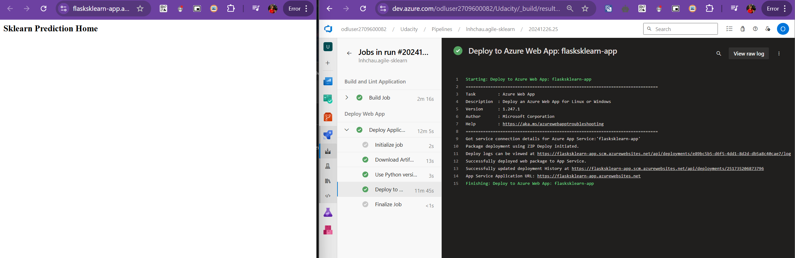

3. **Load Testing** :

* Use **Locust** for load testing by running
  ```
  ./loadtesting.sh
  ```

- Open Locust UI at `http://localhost:8089/` to monitor performance.

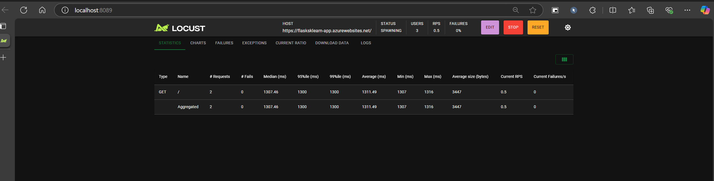

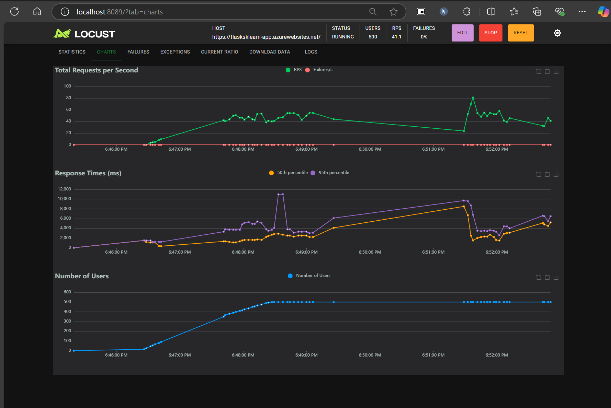

---

## **Cleaning Up**

* Delete Azure resources:
  * Navigate to the Azure Portal, locate the resource group, and delete it.

---

## **Future Enhancements**

1. Add more test cases.
2. Create a UI for predictions.
3. Use GitHub Actions for both CI and CD.
4. Deploy the app on a Kubernetes cluster.

---

## **YouTube Demo**

* [Watch the Demo](https://youtu.be/1zjTSBJavS8)
